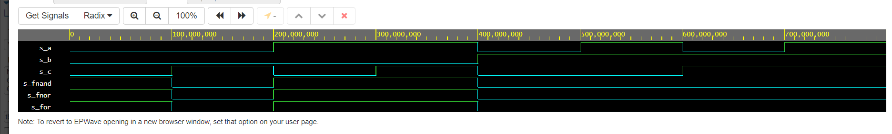
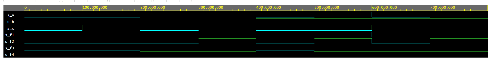

# První cvičení

## Ověření de Morganových zákonů funkce f(c,b,a)

### Zdrojový kód v edaplayground
```vhdl
architecture dataflow of gates is
begin
    f_o  <= ((not b_i) and a_i) or ((not c_i) and (not b_i));
    fnand_o <= not (not (not b_i and a_i) and not(not b_i and not c_i)); 
    fnor_o <= not (b_i or not a_i) or not (c_i or b_i);

end architecture dataflow;
```
### Tabulka hodnot
| **c** | **b** |**a** | **f(c,b,a)** |
| :-: | :-: | :-: | :-: |
| 0 | 0 | 0 | 1 |
| 0 | 0 | 1 | 1 |
| 0 | 1 | 0 | 0 |
| 0 | 1 | 1 | 0 |
| 1 | 0 | 0 | 0 |
| 1 | 0 | 1 | 1 |
| 1 | 1 | 0 | 0 |
| 1 | 1 | 1 | 0 |
### Obrázek simulace a odkaz na edaplayground


https://www.edaplayground.com/x/CwhY

## Ověření de distributivních zákonů

### Zdrojový kód v edaplayground
```vhdl
architecture dataflow of gates is
begin
    f1_o <= (a_i and b_i)or(a_i and c_i); 
    f2_o <= a_i and (b_i or c_i); 
    f3_o <= (a_i or b_i) and (a_i or c_i); 
    f4_o <= a_i or (b_i and c_i);

end architecture dataflow;
```
### Obrázek simulace a odkaz na edaplayground


https://www.edaplayground.com/x/maai
