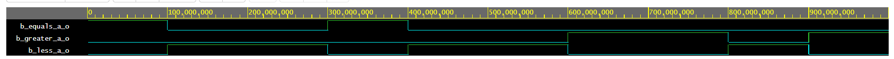

# 2 cvičení

## Domácí příprava
| **Dec. equivalent** | **B[1:0]** | **A[1:0]** | **B is greater than A** | **B equals A** | **B is less than A** |
| :-: | :-: | :-: | :-: | :-: | :-: |
| 0 | 0 0 | 0 0 | 0 | 1 | 0 |
| 1 | 0 0 | 0 1 | 0 | 0 | 1 |
| 2 | 0 0 | 1 0 | 0 | 0 | 1 |
| 3 | 0 0 | 1 1 | 0 | 0 | 1 |
| 4 | 0 1 | 0 0 | 1 | 0 | 0 |
| 5 | 0 1 | 0 1 | 0 | 1 | 0 |
| 6 | 0 1 | 1 0 | 0 | 0 | 1 |
| 7 | 0 1 | 1 1 | 0 | 0 | 1 |
| 8 | 1 0 | 0 0 | 1 | 0 | 0 |
| 9 | 1 0 | 0 1 | 1 | 0 | 0 |
| 10 | 1 0 | 1 0 | 0 | 1 | 0 |
| 11 | 1 0 | 1 1 | 0 | 0 | 1 |
| 12 | 1 1 | 0 0 | 1 | 0 | 0 |
| 13 | 1 1 | 0 1 | 1 | 0 | 0 |
| 14 | 1 1 | 1 0 | 1 | 0 | 0 |
| 15 | 1 1 | 1 1 | 0 | 1 | 0 |

Rovná se SoP= B&#862;<sub>1</sub>B&#862;<sub>0</sub>A&#862;<sub>1</sub>A&#862;<sub>0</sub>+B&#862;<sub>1</sub>B<sub>0</sub>A&#862;<sub>1</sub>A<sub>0</sub>+B<sub>1</sub>B&#862;<sub>0</sub>A<sub>1</sub>A&#862;<sub>0</sub>+B<sub>1</sub>B<sub>0</sub>A<sub>1</sub>A<sub>0</sub>

Menší PoS = (B<sub>1</sub>+B<sub>0</sub>+A<sub>1</sub>+A<sub>0</sub>)&hairsp;&middot;&hairsp;(B<sub>1</sub>+B&#862;<sub>0</sub>+A<sub>1</sub>+A<sub>0</sub>)&hairsp;&middot;&hairsp;(B<sub>1</sub>+B&#862;<sub>0</sub>+A<sub>1</sub>+A&#862;<sub>0</sub>)&hairsp;&middot;&hairsp;(B&#862;<sub>1</sub>+B<sub>0</sub>+A<sub>1</sub>+A<sub>0</sub>)&hairsp;&middot;&hairsp;(B&#862;<sub>1</sub>+B<sub>0</sub>+A<sub>1</sub>+A&#862;<sub>0</sub>)&hairsp;&middot;&hairsp;(B&#862;<sub>1</sub>+B<sub>0</sub>+A&#862;<sub>1</sub>+A<sub>0</sub>)&hairsp;&middot;&hairsp;(B&#862;<sub>1</sub>+B&#862;<sub>0</sub>+A<sub>1</sub>+A<sub>0</sub>)&hairsp;&middot;&hairsp;(B&#862;<sub>1</sub>+B&#862;<sub>0</sub>+A<sub>1</sub>+A&#862;<sub>0</sub>)&hairsp;&middot;&hairsp;(B&#862;<sub>1</sub>+B&#862;<sub>0</sub>+A&#862;<sub>1</sub>+A<sub>0</sub>)&hairsp;&middot;&hairsp;(B&#862;<sub>1</sub>+B&#862;<sub>0</sub>+A&#862;<sub>1</sub>+A&#862;<sub>0</sub>)

## 2-bit komparátor
### *K-mapa pro funkci A se rovná B*
|           |           |         |  **A1,A0**  |           |           |
| :-:       | :-:       | :-:     | :-:         | :-:       | :-:       | 
|           |           | **0 0** | **0 1**     | **1 1**   | **1 0**   | 
|           | **0 0**   | *1*     | 0           | 0         | 0         | 
| **B1,B0** |  **0 1**  | 0       | *1*         | 0         |  0        |
|           | **1 1**   | 0       | 0           | *1*       | 0         |
|           | **1 0**   | 0       | 0           | 0         | *1*       |


### *K-mapa pro funkci B je větší A*
|           |           |         |  **A1,A0**  |           |           |
| :-:       | :-:       | :-:     | :-:         | :-:       | :-:       | 
|           |           | **0 0** | **0 1**     | **1 1**   | **1 0**   | 
|           | **0 0**   | 0       | 0           | 0         | 0         | 
| **B1,B0** |  **0 1**  | *1*     | 0           | 0         |  0        |
|           | **1 1**   | *1*     | *1*         | 0         | *1*       |
|           | **1 0**   | *1*     | *1*         | 0         | 0         |

Větší SoP min = B<sub>1</sub>A&#862;<sub>1</sub>+B<sub>0</sub>A&#862;<sub>1</sub>A&#862;<sub>0</sub>+B<sub>0</sub>B<sub>1</sub>A&#862;<sub>0</sub>

### *K-mapa pro funkci B je menší A*
|           |           |         |  **A1,A0**  |           |           |
| :-:       | :-:       | :-:     | :-:         | :-:       | :-:       | 
|           |           | **0 0** | **0 1**     | **1 1**   | **1 0**   | 
|           | **0 0**   | *0*     | 1           | 1         | 1         | 
| **B1,B0** |  **0 1**  | *0*     | *0*         | 1         |  1        |
|           | **1 1**   | *0*     | *0*         | *0*       | *0*       |
|           | **1 0**   | *0*     | *0*         | 1         | *0*       |

Menší PoS min = (A<sub>0</sub>+A<sub>1</sub>)&hairsp;&middot;(B&#862;<sub>0</sub>+A<sub>1</sub>)&hairsp;&middot;(B&#862;<sub>1</sub>+A<sub>1</sub>)&hairsp;&middot;(B&#862;<sub>1</sub>+A<sub>0</sub>)&hairsp;&middot;(B&#862;<sub>0</sub>+B&#862;<sub>1</sub>)

### Odkaz na edaplayground

https://www.edaplayground.com/x/QEwb

## 4-bit komparátor

### design.vhd
```vhdl
entity comparator_2bit is
    port(
        a_i           : in  std_logic_vector(4 - 1 downto 0);
        b_i           : in  std_logic_vector(4 - 1 downto 0);


        -- COMPLETE ENTITY DECLARATION

		B_greater_A_o : out std_logic;
        B_equals_A_o  : out std_logic;
        B_less_A_o    : out std_logic       -- B is less than A
    );
end entity comparator_2bit;

------------------------------------------------------------------------
-- Architecture body for 2-bit binary comparator
------------------------------------------------------------------------
architecture Behavioral of comparator_2bit is
begin
    B_greater_A_o <= '1' when (b_i > a_i) else '0';
    B_equals_A_o  <= '1' when (b_i = a_i) else '0';
    B_less_A_o    <= '1' when (b_i < a_i) else '0';


    -- WRITE "GREATER" AND "EQUALS" ASSIGNMENTS HERE


end architecture Behavioral;
```
### testbench.vhd

```vhdl
    p_stimulus : process
    begin
        -- Report a note at the begining of stimulus process
        report "Stimulus process started" severity note;


        -- First test values
        s_b <= "0000"; s_a <= "0000"; wait for 100 ns;
        -- Expected output
        assert ((s_B_greater_A = '0') and (s_B_equals_A = '1') and (s_B_less_A = '0'))
        -- If false, then report an error
        report "Test failed for input combination: 0000, 0000" severity error;
        
        
        -- WRITE OTHER TESTS HERE
		s_b <= "0000"; s_a <= "0010"; wait for 100 ns;
		assert ((s_B_greater_A = '0') and (s_B_equals_A = '0') and (s_B_less_A = '1'))
		report "Test failed for input combination: 0000, 0010" severity error;
        
        s_b <= "0000"; s_a <= "1111"; wait for 100 ns;
		assert ((s_B_greater_A = '0') and (s_B_equals_A = '0') and (s_B_less_A = '1'))
		report "Test failed for input combination: 0000, 1111" severity error;
        
        s_b <= "0001"; s_a <= "0001"; wait for 100 ns;
		assert ((s_B_greater_A = '0') and (s_B_equals_A = '1') and (s_B_less_A = '0'))
		report "Test failed for input combination: 0001, 0001" severity error;
        
        s_b <= "0001"; s_a <= "0110"; wait for 100 ns;
		assert ((s_B_greater_A = '0') and (s_B_equals_A = '0') and (s_B_less_A = '1'))
		report "Test failed for input combination: 0001, 0110" severity error;
        
        s_b <= "0001"; s_a <= "0100"; wait for 100 ns;
		assert ((s_B_greater_A = '0') and (s_B_equals_A = '0') and (s_B_less_A = '1'))
		report "Test failed for input combination: 0001, 0100" severity error;
        
        s_b <= "1010"; s_a <= "0010"; wait for 100 ns;
		assert ((s_B_greater_A = '1') and (s_B_equals_A = '0') and (s_B_less_A = '0'))
		report "Test failed for input combination: 1010, 0010" severity error;
        
        s_b <= "1011"; s_a <= "1010"; wait for 100 ns;
		assert ((s_B_greater_A = '1') and (s_B_equals_A = '0') and (s_B_less_A = '0'))
		report "Test failed for input combination: 1011, 1010" severity error;
        
        --Tady je chyba
        s_b <= "1011"; s_a <= "1111"; wait for 100 ns;
		assert ((s_B_greater_A = '0') and (s_B_equals_A = '1') and (s_B_less_A = '0'))
		report "Test failed for input combination: 1011, 1111" severity error;
        
        s_b <= "1100"; s_a <= "0100"; wait for 100 ns;
		assert ((s_B_greater_A = '1') and (s_B_equals_A = '0') and (s_B_less_A = '0'))
		report "Test failed for input combination: 1100, 0100" severity error;
        
        report "Stimulus process finished" severity note;
        wait;
    end process p_stimulus;

end architecture testbench;
```
### output s jednou chybou
```vhdl
[2021-02-21 15:02:50 EST] ghdl -i design.vhd testbench.vhd  && ghdl -m  tb_comparator_2bit && ghdl -r  tb_comparator_2bit   --vcd=dump.vcd && sed -i 's/^U/X/g; s/^-/X/g; s/^H/1/g; s/^L/0/g' dump.vcd 
analyze design.vhd
analyze testbench.vhd
elaborate tb_comparator_2bit
testbench.vhd:51:9:@0ms:(report note): Stimulus process started
testbench.vhd:93:16:@900ns:(assertion error): Test failed for input combination: 1011, 1111
testbench.vhd:100:9:@1us:(report note): Stimulus process finished
Finding VCD file...
./dump.vcd
[2021-02-21 15:02:51 EST] Opening EPWave...
Done
```
### EPWave



### Odkaz na edaplayground

https://www.edaplayground.com/x/wUYD
